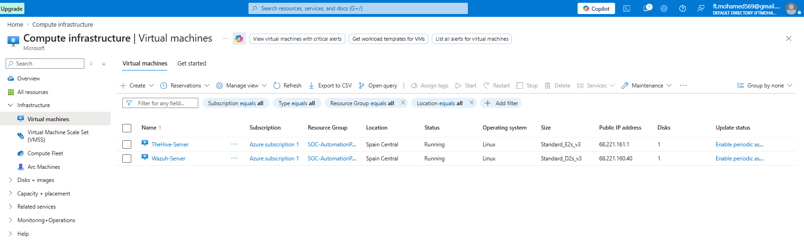
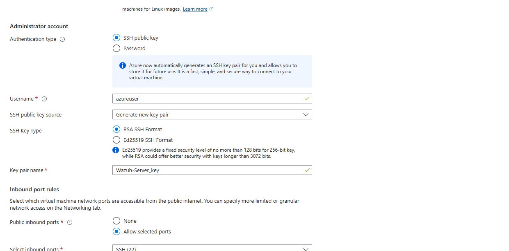
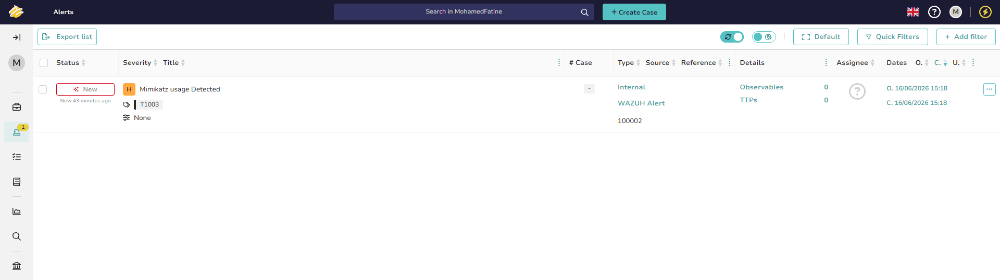

# SOC Automation Lab – Wazuh, Shuffle, VirusTotal, TheHive & Email Notification

## Overview

This project demonstrates an end-to-end Security Operations Center (SOC) automation workflow that detects malicious activity, enriches indicators with threat intelligence, automatically creates incidents, and notifies analysts for investigation.

The solution integrates Wazuh SIEM, Sysmon, Shuffle SOAR, VirusTotal, TheHive, and Email Notification services to automate detection, enrichment, incident creation, and alert escalation.

---

## Architecture Diagram

---

## Project Objectives

* Detect malicious activity using Sysmon and Wazuh
* Identify Mimikatz execution through custom detection rules
* Automate alert processing using Shuffle SOAR
* Enrich indicators using VirusTotal threat intelligence
* Automatically create incidents in TheHive
* Notify analysts through automated email alerts
* Simulate a real-world SOC workflow from detection to investigation

---

## Technology Stack

### Monitoring & Detection

* Sysmon
* Wazuh Manager
* Wazuh Agent

### Security Automation

* Shuffle SOAR

### Threat Intelligence

* VirusTotal API

### Incident Management

* TheHive

### Notification Services

* Email Notification Integration

### Operating Systems

* Ubuntu Linux
* Windows Endpoint

---

## Architecture Workflow

Windows Endpoint
↓
Sysmon Event ID 1 (Process Creation)
↓
Wazuh Agent
↓
Wazuh Manager
↓
Custom Mimikatz Detection Rule
↓
Webhook Integration
↓
Shuffle SOAR
↓
SHA256 Extraction (Regex)
↓
VirusTotal Enrichment
↓
TheHive Alert Creation
↓
Email Notification
↓
SOC Analyst Investigation

---

## Lab Environment

### Azure Virtual Machines

### Wazuh Dashboard

---

## Detection Workflow

### Step 1 – Endpoint Monitoring

Sysmon monitors process creation events and generates Event ID 1 logs.

### Step 2 – Detection Engineering

Wazuh ingests Sysmon logs and applies custom detection rules designed to identify Mimikatz execution activity.

#### Mimikatz Detection

### Step 3 – Alert Forwarding

Matching alerts are forwarded from Wazuh to Shuffle through a webhook integration.

### Step 4 – IOC Extraction

Shuffle extracts the SHA256 hash from Sysmon event data using regex parsing.

#### Shuffle SOAR Workflow

### Step 5 – Threat Intelligence Enrichment

The extracted hash is submitted to VirusTotal for reputation analysis and threat intelligence enrichment.

### Step 6 – Incident Creation

Shuffle automatically creates a TheHive alert containing:

* Alert title
* Hostname
* Rule ID
* Severity
* MITRE ATT&CK mapping
* VirusTotal results
* Original event details

#### TheHive Alert

### Step 7 – Analyst Notification

An automated email notification is generated and sent to the SOC analyst with incident details.

### Step 8 – Investigation

The analyst reviews and investigates the alert in TheHive.

---

## Key Features

* Automated Mimikatz detection
* Custom Wazuh detection rules
* Webhook-based SIEM to SOAR integration
* SHA256 extraction using regex
* VirusTotal threat intelligence enrichment
* Automated TheHive incident creation
* Automated analyst email notifications
* End-to-end SOC orchestration

---

## Infrastructure Configuration

This project required configuration and customization across multiple security platforms, including:

* Wazuh custom detection rules
* Wazuh integration configuration (ossec.conf)
* Filebeat configuration and log forwarding
* Sysmon event collection and monitoring
* Shuffle webhook integrations
* VirusTotal API integration
* TheHive alert ingestion configuration
* Linux service management and troubleshooting

These configurations were manually implemented and tested to ensure reliable end-to-end SOC automation.

---

## Technical Challenges Solved

* Configured custom Wazuh integrations
* Established reliable webhook communication between Wazuh and Shuffle
* Parsed Sysmon hash fields using regex
* Passed variables between workflow actions
* Integrated VirusTotal API
* Built custom JSON templates for TheHive alerts
* Resolved API schema and field mapping issues
* Automated email-based incident escalation
* Created and tested custom Wazuh detection rules using the Wazuh Rule Manager
* Validated rule matching against Sysmon process creation events

---

## Infrastructure Access

### Wazuh Server Access

### TheHive Server Access

---

## Skills Demonstrated

* SIEM Engineering
* Detection Engineering
* Security Automation
* SOAR Development
* Threat Intelligence Enrichment
* Incident Response
* Log Analysis
* Linux Administration
* API Integration
* JSON Processing
* Regex Development
* Custom Wazuh Rule Development
* Rule Tuning & Alerting

---

## End Result

Successfully developed an automated SOC workflow that detects malicious activity, enriches indicators with threat intelligence, creates incidents in TheHive, and notifies analysts automatically, reducing manual triage effort and improving incident response efficiency.
